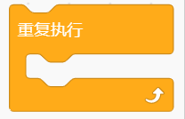

# KidsBlock

## 1. KidsBlock简介  

KidsBlock是一种图形化编程工具，旨在帮助初学者，尤其是儿童和青少年，轻松入门编程。它利用面向对象的思想，通过简单的拖拽模块来创建程序，无需复杂的编码语法，使得学习编程变得直观和有趣。KidsBlock特别支持Arduino平台，为用户提供互动的电子项目开发体验。通过丰富的模块库和简单易懂的界面，KidsBlock能够帮助用户构建各式各样的电子项目，培养他们的创造力、逻辑思维和问题解决能力。  

## 2. 连接图  

  

## 3. 测试代码  

1. 在事件栏拖出Arduino启动模块。  

     

2. 在引脚栏拖出两个设置引脚模式模块，一个设置为引脚3输入，另一个设置为引脚13输出。  

     

3. 在控制栏拖出重复执行模块。  

     

4. 在控制栏拖出判断模块，并在判断模块中添加运算的等于模块。将等于模块的左边添加读取数字引脚3模块，右边设为0；满足条件时第13引脚输出高电平，不满足条件时第13引脚输出低电平。  

     

## 4. 测试结果  

按照上图接好线，烧录好代码；上电后，按下按键，Arduino UNO板上的D13指示灯亮起。  

## 5. 加强训练  

**代码：**  

  

## 结果  

上传代码后，按一下按键LED灯亮起，再按一下按键LED灯熄灭。实现这个功能的关键在于变量X，值得深入思考。

