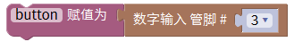
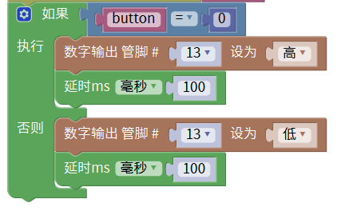

# Mixly

## 1. Mixly简介  

Mixly是一款图形化编程工具，旨在帮助初学者，特别是儿童和青少年，轻松学习编程。用户可以通过简单的拖拽模块来创建程序，无需掌握复杂的编码语法，学习过程变得直观而有趣。Mixly支持Arduino硬件平台，使用户能够快速构建和测试各种电子项目。此外，该工具提供丰富的示例和项目教程，帮助用户在实践中理解编程的逻辑。  

Mixly的主要特点包括：  
- **图形化编程**：用户可以通过拖拽模块的方式完成编程，非常适合编程初学者。  
- **支持多种硬件**：兼容Arduino及其他开源硬件，用户可以与多种传感器和执行器进行交互。  
- **丰富的资源**：提供大量项目示例和详细说明，帮助用户深入理解编程概念。  
- **易于上手**：界面友好，学习材料丰富，使得用户可以快速入门，进行创造性项目。  

## 2. 连接图  

  

## 3. 测试代码  

1. 在变量栏找到声明全局变量模块，将item变量名改为“button”，并设置button初始变量为整数，赋值为0。  

     

2. 初始化设置波特率为9600，这一设置用于串口通信。  

     

3. 拖出button赋值模块，再拖出数字引脚输入模块，设置引脚为3。  

     

4. 拖出串口栏下的打印并自动换行模块，并将定义的变量button放在打印模块后面。  

     

5. 拖出判断模块，并在该模块中设置一个“否则”选项。  

     

6. 在逻辑栏中拖出一个等于模块，添加变量button和数字0。  

     

7. 拖出设置引脚模块，设置引脚为13，高电平，并设置延时为100ms。  

     

8. 再次拖出设置引脚模块，将引脚设为13的低电平，并设置延时为100ms。  

     

## 4. 测试结果  

按照上图接好线，烧录好代码；上电后，按下按键后，LED模块灯亮起。  

## 5. 加强训练  

**代码：**  

  

## 结果  

上传代码后，按一下按键LED灯亮起，再按一下按键LED灯熄灭。实现这个功能的关键在于变量X，值得深入思考。

