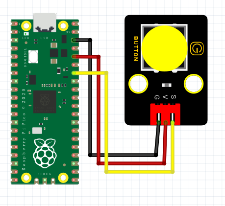

# Python


## 1. Python简介  

Python是一种高级编程语言，以其简单易读的语法和强大的功能而广泛应用。由Guido van Rossum于1991年发布，Python支持多种编程范式，包括面向对象、过程式和函数式编程。其简单的语法使得Python非常适合初学者，同时它的强大生态系统和丰富的库支持使得Python在数据分析、机器学习、网络开发等多个领域也广泛使用。  

Python的关键特性包括：  
- **易读性**：Python的代码可读性极高，缩进结构清晰，易于理解和维护。  
- **丰富的库和框架**：Python有大量的标准库和第三方库，例如NumPy、Pandas、Flask和Django，支持各种应用开发。  
- **跨平台性**：Python可以在Windows、macOS和Linux等多个操作系统上运行。  
- **活跃的社区**：具有强大的社区支持，用户可以方便地找到帮助、资源和项目案例。  

## 2. 连接图  

  

## 3. 测试代码  

```python  
import machine  
import utime  

key = machine.Pin(28, machine.Pin.IN)  # 设置28脚为输入  
led = machine.Pin(25, machine.Pin.OUT)  # 设置25脚为输出  

while True:  
    if key.value() == 0:  # 判断输入是否为低电平  
        led.value(1)  # LED灯亮  
    else:  
        led.value(0)  # LED灯灭  
```  

## 4. 测试结果  

按照上图接好线，烧录好代码；上电后，按下按键时，Pico板上的指示灯亮起。  

## 5. 加强训练  

**代码：**  

```python  
import machine  
import utime  

key = machine.Pin(28, machine.Pin.IN)  # 设置28脚为输入  
led = machine.Pin(25, machine.Pin.OUT)  # 设置25脚为输出  
val = 0  # 初始化变量  

while True:  
    if key.value() == 0:  # 判断按键是否被触摸  
        val += 1  # 计数加1  
        led.value(1)  # LED灯亮  
        utime.sleep_ms(300)  # 延时300ms  

    if val == 2:  # 当触摸次数达到2次时  
        led.value(0)  # LED灯熄灭  
        val = 0  # 重置计数  
        utime.sleep_ms(300)  # 延时300ms  
```  

## 结果  

上传代码后，按一下按键LED灯亮起，再按一下按键LED灯熄灭。实现这个功能的关键在于变量val，值得深入思考。


